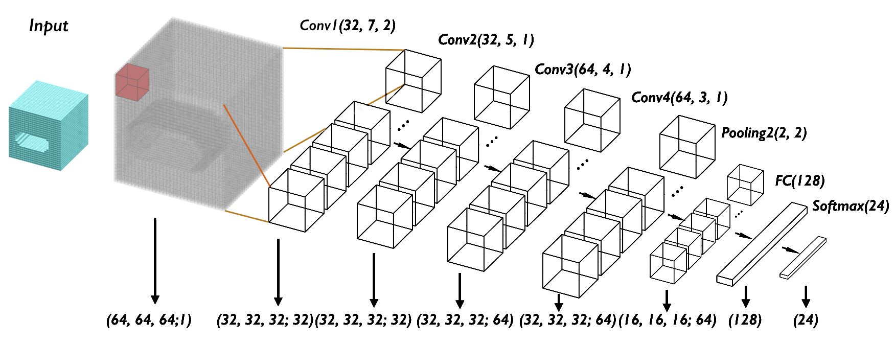

# FeatureNet
This is a re-implementation of FeatureNet in Tensorflow 2. FeatureNet is a deep learning architecture for machining feature recognition that utilises a voxel representation and 3D CNN.

The code is based on this original [paper](https://www.sciencedirect.com/science/article/abs/pii/S0010448518301349). This paper's original code can be found [here](https://github.com/zibozzb/FeatureNet) and dataset is available [here](https://github.com/madlabub/Machining-feature-dataset).

## Requirements
- Python > 3.8.5
- Tensorflow > 2.2.0
- Numpy > 1.19.1
- h5py > 1.10.6
- Binvox (Opensource software)

## Citation
    @article{featurenet2018,
      Author = {Zhibo Zhang, PrakharJaiswal, Rahul Rai},
      Journal = {Computer-Aided Design},
      Title = {FeatureNet: Machining feature recognition based on 3D Convolution Neural Network},
      Year = {2018}
    }

    @article{featurenettensorflow2,
      Author = {Andrew R Colligan},
      Title = {FeatureNet Tensorflow 2},
      Journal = {https://gitlab.com/qub_femg/machine-learning/featurenet-tensorflow-2},
      Year = {2021}
}
